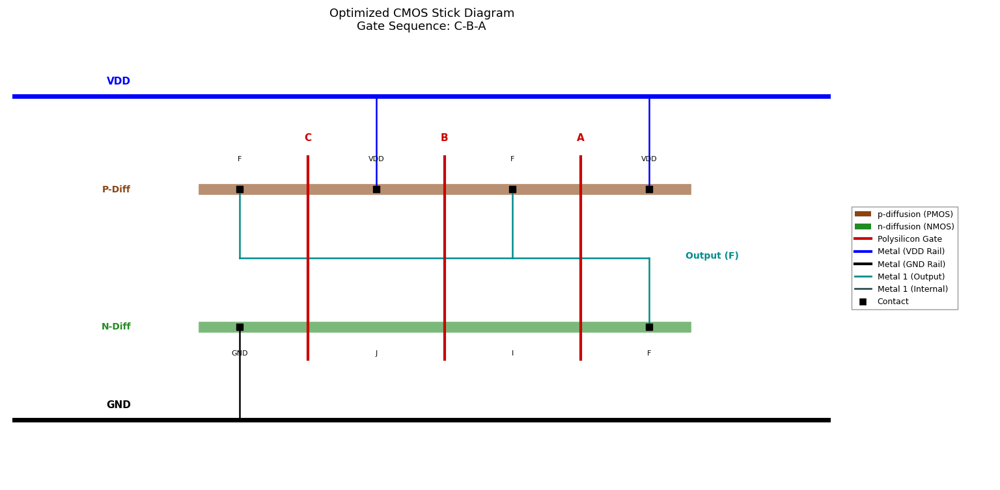

# network2stick
  
#### Python script converts Electrical Circuits network into optimized Stick diagram by finding all possible unique paths (Euler's path) then choose the consistent one then draw the stick diagram.
--- 
**Nodes are Electrical Circuits nodes, Edges are transistors**

## Stick Diagram Example

  
   
  <em>Generated stick diagram for a 3-input NAND gate</em>

